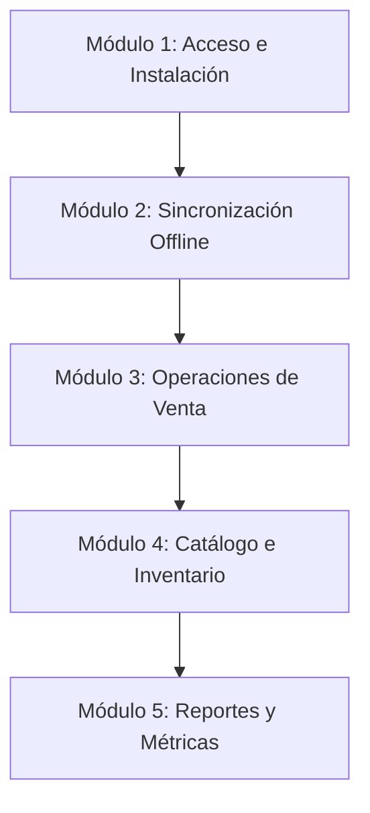

# Manual de Instalación, Capacitación y Mantenimiento - Distribuidora M-H

Este documento es una guía maestra integral que cubre desde la información corporativa y planes de capacitación, pasando por las instrucciones de instalación para clientes finales (Desktop y Web), hasta la guía de despliegue y mantenimiento técnico para desarrolladores.

---

## 📋 SECCIÓN 1: Ficha del Proyecto y Capacitación

### 1.1 Información del Proyecto
| Concepto | Detalle |
| :--- | :--- |
| **Nombre del Sistema** | Sistema de Gestión Comercial Distribuidora M-H (Universal App) |
| **Cliente / Institución** | Distribuidora M-H |
| **Responsable de Capacitación** | Adal Romero (Líder de Desarrollo y Soporte) |
| **Fecha de Sesión** | *[Insertar Fecha]* |
| **Lugar de Sesión** | *[Insertar Lugar / Virtual (Teams/Meet/Zoom)]* |

### 1.2 Condiciones de la Capacitación
- **Modalidad**: Mixta (Sesión teórico-práctica virtual inicial de 3 horas + Acompañamiento presencial de 3 horas en campo/operaciones).
- **Duración Estimada**: 6 horas totales de capacitación presencial/virtual.
- **Número de Capacitadores**: 1 Instructor líder (Adal Romero) + 1 Asistente de soporte técnico.
- **Perfil de Participantes**: Administradores de TI/Negocio, personal de ventas y distribución en ruta, y gestores de almacén/despacho.

---

## 🎯 SECCIÓN 2: Plan de Capacitación y Metodología

### 2.1 Objetivo General
Capacitar al personal administrativo y operativo de **Distribuidora M-H** en el uso eficiente del sistema comercial, asegurando una transición fluida al nuevo entorno tecnológico, optimizando la toma de pedidos móviles (online/offline) y explotando el uso de métricas comerciales en tiempo real.

### 2.2 Perfiles a Capacitar (Público Objetivo)
1. **Perfil Administrativo / Gerencial**:
   - *Rol*: Supervisión de ventas, control de catálogo de productos, visualización de métricas en paneles interactivos y administración de usuarios.
2. **Perfil de Ventas y Distribución en Ruta**:
   - *Rol*: Toma de pedidos diarios en campo, registro de clientes, gestión de ventas offline-first (sin internet) y sincronización de datos con Supabase.

### 2.3 Temario Completo (Estructura de Aprendizaje)


* **Módulo 1: Introducción y Acceso al Entorno**:
  - Descarga e inicio del ejecutable de escritorio (`.exe` portable o instalado).
  - Acceso al sistema mediante la plataforma en la nube (Vercel).
  - Inicio de sesión y seguridad (autenticación única de Supabase).
* **Módulo 2: Sincronización Offline-First (WatermelonDB)**:
  - Comprensión del funcionamiento sin conexión a internet.
  - Carga inicial en caché (primer inicio de sesión).
  - Resolución manual y automática de conflictos de sincronización.
* **Módulo 3: Registro de Pedidos y Ventas**:
  - Creación de un pedido/venta desde la interfaz móvil/web.
  - Cola de sincronización: qué pasa cuando se guarda un pedido sin señal.
  - Sincronización automática una vez recuperada la conexión de red.
* **Módulo 4: Administración del Catálogo de Productos**:
  - Creación, modificación y desactivación de productos.
  - Carga de imágenes comerciales y fijación de listas de precios.
* **Módulo 5: Dashboard, Reportes y Análisis Comercial**:
  - Lectura de gráficas interactivas en Recharts.
  - Exportación de listados a Excel (`xlsx`) e informes de venta en PDF.

### 2.4 Metodología de Enseñanza
Implementamos la metodología **Learning by Doing (70% Práctica, 30% Teoría)** estructurada de la siguiente manera:
1. **Demostración Activa (30%)**: El instructor explica y proyecta en pantalla la funcionalidad.
2. **Práctica Guiada (40%)**: Los participantes repiten el proceso en sus respectivas computadoras con un set de datos de prueba preestablecido.
3. **Escenarios Reales / Simulación (30%)**: Ejercicio libre donde se simulan situaciones del negocio reales (ej. "Registrar 3 pedidos en ruta en una zona sin internet y luego sincronizarlos al volver al almacén").

### 2.5 Recursos y Materiales Requeridos
#### Recursos Técnicos e Infraestructura:
- Computadoras de los usuarios (Windows 10/11 con arquitectura de 64 bits para la versión `.exe`).
- Dispositivos móviles/tablets si se requiere probar la aplicación nativa.
- Proyector de alta resolución o pantalla interactiva para el instructor.
- Acceso a internet estable (requerido exclusivamente para la sincronización inicial y finalización de sesión).
- Cuentas de usuario de prueba generadas previamente en el dashboard administrativo.

#### Materiales Físicos y Didácticos:
- Manuales impresos / digitales de consulta rápida (PDF).
- Hojas de asistencia y registro de participación.
- **Hoja de Chequeo de Progreso (Progress Checklist)**: Plantilla individual para evaluar la destreza de los usuarios antes de finalizar la capacitación.

### 2.6 Evidencias de Capacitación
Para certificar que el proceso de capacitación se completó correctamente, el responsable recabará las siguientes evidencias:
* 📷 **Fotografías de la Sesión**: Capturas de pantalla (capacitación virtual) o fotografías del salón (capacitación presencial) donde se observe la interacción de los usuarios.
* 📝 **Lista de Asistencia**: Documento firmado por cada participante certificando el número de horas cursadas.
* 📑 **Manual Entregado**: Registro de recepción del manual de usuario final.
* 🎯 **Evaluación Competente**: Prueba práctica final donde el usuario realiza autónomamente los procesos críticos (crear un pedido, sincronizarlo, y consultar un reporte).

---

## 💻 SECCIÓN 3: Guía de Instalación y Uso para el Cliente Final

El sistema comercial **Distribuidora M-H** es una aplicación universal diseñada para funcionar donde sea conveniente para tu negocio. Sigue los pasos según la plataforma que desees utilizar:

### 3.1 Versión de Escritorio Windows (`.exe`)
La aplicación de escritorio se encuentra empaquetada en dos formatos distintos que puedes solicitar a tu administrador o encontrar en la carpeta `desktop/dist-desktop/`.

#### Opción A: Instalador de Escritorio (`Distribuidora M-H Setup 1.0.0.exe`)
> [!NOTE]
> Recomendado para computadoras de oficina fijas o laptops de uso continuo de la empresa.

1. **Ejecutar el Instalador**: Haz doble clic sobre el archivo `Distribuidora M-H Setup 1.0.0.exe`.
2. **Permisos de Administrador**: Si Windows muestra una advertencia de "Editor Desconocido" (SmartScreen), haz clic en **"Más información"** y luego en **"Ejecutar de todas formas"**.
3. **Paso a Paso**: Sigue las instrucciones de instalación, selecciona la carpeta de destino y presiona **Instalar**.
4. **Accesos Directos**: El instalador creará automáticamente un icono de acceso directo en tu Escritorio y en tu menú de Inicio.
5. **Listo para Usar**: Abre la aplicación. Esta se ejecutará en una ventana independiente libre de navegadores, proporcionando una interfaz rápida y enfocada en el trabajo.

#### Opción B: Versión Portable (`Distribuidora M-H 1.0.0.exe`)
> [!TIP]
> Ideal para llevar en memorias USB, probar la app rápidamente, o para computadoras donde no tienes permisos para instalar programas.

1. Copia el archivo `Distribuidora M-H 1.0.0.exe` a cualquier ubicación de tu disco (por ejemplo, el Escritorio o Documentos) o a una memoria USB.
2. Haz doble clic sobre el archivo.
3. La aplicación se ejecutará instantáneamente sin pantallas de carga de instalación previa. ¡Puedes empezar a trabajar de inmediato!

---

### 3.2 Versión Web en la Nube (Vercel)
> [!IMPORTANT]
> Excelente para dispositivos móviles, tablets o para acceder rápidamente desde cualquier navegador (Chrome, Edge o Safari).

1. Abre tu navegador favorito e ingresa a la dirección URL de producción provista por tu administrador:
   `https://distribuidora-m-h.vercel.app` *(o el dominio personalizado contratado)*.
2. **Instalación como Web App (PWA) - Opcional pero Altamente Recomendado**:
   - **En Google Chrome / Edge (Computadora)**: Haz clic en el ícono de monitor con flecha hacia abajo en la barra de direcciones superior derecha (o presiona los 3 puntos `...` > `Guardar y compartir` > `Instalar aplicación`).
   - **En Dispositivos Android / iOS (Móvil)**: Abre la página en Chrome o Safari, presiona el menú de opciones del navegador y selecciona **"Agregar a la pantalla de inicio"**.
3. Esto instalará un acceso rápido en tu dispositivo móvil o computadora y permitirá que el sistema trabaje de manera aislada y con alto soporte offline.

---

## 🔧 SECCIÓN 4: Plan de Mantenimiento y Soporte Continuo

Para garantizar que el sistema opere al 100% de su capacidad a lo largo del tiempo, se define el siguiente protocolo de mantenimiento y actualizaciones:

### 4.1 Gestión de Errores y Fallas (Mantenimiento Correctivo)
* **Canales de Reporte**: Todo error crítico (falla de base de datos, pérdidas de sincronización o bloqueos de interfaz) debe reportarse al correo de soporte técnico o mediante el grupo de control con capturas de pantalla de la consola de desarrollo (F12 en Web/Desktop).
* **Logs y Auditoría**: El sistema guarda internamente un registro de operaciones locales en el adaptador SQLite/LokiJS. En caso de fallas de sincronización, la consola web muestra las bitácoras con el origen exacto del fallo en el servidor de Supabase.
* **Resolución de Conflictos Offline**: Si dos vendedores editan el mismo producto o cliente al mismo tiempo sin internet, al sincronizarse prevalecerá la regla del cambio más reciente (last-write-wins). Los administradores pueden auditar estas escrituras en las tablas del histórico de Supabase.

### 4.2 Actualizaciones y Mejoras (Mantenimiento Evolutivo)
* **Actualizaciones Semimayores (Web)**: Los cambios visuales y funcionales aplicados al repositorio principal se despliegan automáticamente en Vercel tras realizar un `git push` a la rama `main`. El navegador de los clientes actualizará la interfaz en segundo plano al recargar la página.
* **Actualizaciones de Escritorio (Desktop)**: Cuando se liberen nuevas versiones del ejecutable `.exe` (mejoras de rendimiento de Electron, accesos nativos), se notificará a los usuarios para que descarguen y sobrescriban el ejecutable portable o ejecuten el nuevo instalador actualizado.
* **Limpieza y Mantenimiento del Almacenamiento**: Si la base de datos local se corrompe o satura la memoria del navegador, el usuario puede realizar una limpieza absoluta ejecutando la función de "Restablecer Datos" en la configuración de la app, forzando una nueva descarga íntegra del catálogo desde Supabase.

---

## 🛠 SECCIÓN 5: Guía de Instalación y Configuración para Desarrolladores

Si eres parte del equipo técnico y necesitas clonar, modificar o compilar el código de **Distribuidora M-H** de forma local, sigue este instructivo técnico detallado:

### 5.1 Requisitos Previos (Entorno de Desarrollo)
- **Node.js** v18 o superior (v24 recomendado).
- **npm** v9 o superior.
- **Git** instalado.
- **Vercel CLI** (Opcional, para simular y gestionar entornos del servidor).

### 5.2 Instalación del Repositorio Local
1. Abre tu terminal y clona el proyecto en tu sistema:
   ```bash
   git clone https://github.com/AdalRomero/Distribuidora_M-H.git
   cd Distribuidora_M-H
   ```
2. Instala el árbol completo de dependencias NodeJS para el backend de React Native, Expo y las vistas de administración:
   ```bash
   npm install
   ```

### 5.3 Configuración de Variables de Entorno
Crea un archivo `.env` en la raíz de tu proyecto para configurar los puntos de enlace hacia tu base de datos de **Supabase**:
```env
EXPO_PUBLIC_SUPABASE_URL=https://<TU_PROYECTO_SUPABASE>.supabase.co
EXPO_PUBLIC_SUPABASE_ANON_KEY=<TU_LLAVE_ANONIMA_DE_SUPABASE>
```
*(Reemplaza los valores con las credenciales anon públicas correspondientes dentro del panel de API en Supabase).*

### 5.4 Ejecución en Desarrollo (Multiplataforma)
El proyecto utiliza **Expo Router**. Puedes arrancar el servidor local con:
```bash
npm start
```
En la consola interactiva que aparece, presiona:
- `w` para lanzar e interactuar con la versión **Web**.
- `a` para abrir el simulador de **Android**.
- `i` para abrir el simulador de **iOS** (Solo disponible en macOS).

También puedes abrir directamente la compilación web con:
```bash
npm run web
```

### 5.5 Integración y Despliegue en Vercel
1. Instala el CLI de Vercel globalmente si no lo tienes:
   ```bash
   npm i -g vercel
   ```
2. Inicia sesión en tu cuenta y vincula el directorio local con tu panel:
   ```bash
   vercel link
   ```
3. Descarga las variables de entorno de producción directamente:
   ```bash
   vercel env pull .env.local
   ```
4. Para compilar y desplegar manualmente a producción:
   ```bash
   vercel --prod
   ```

### 5.6 Compilación del Entorno Desktop (Electron + Executable)
El módulo de escritorio está completamente aislado y preconfigurado en la subcarpeta `/desktop`.

1. **Compilar los activos web y copiarlos al entorno de escritorio**:
   ```bash
   npm run desktop:build-web
   ```
   *(Este comando compila el sitio con Expo y usa el script utilitario de Node para clonar el resultado e iconos a `desktop/dist/`).*

2. **Ejecutar Electron en modo desarrollo para depurar localmente**:
   ```bash
   npm run desktop:start
   ```

3. **Empaquetar e instanciar los instaladores e independientes `.exe` de Windows**:
   ```bash
   npm run desktop:pack
   ```
   *(Los instaladores compilados se generarán en la ruta `desktop/dist-desktop/`).*
